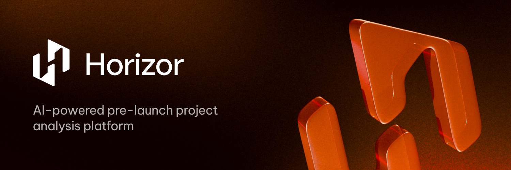
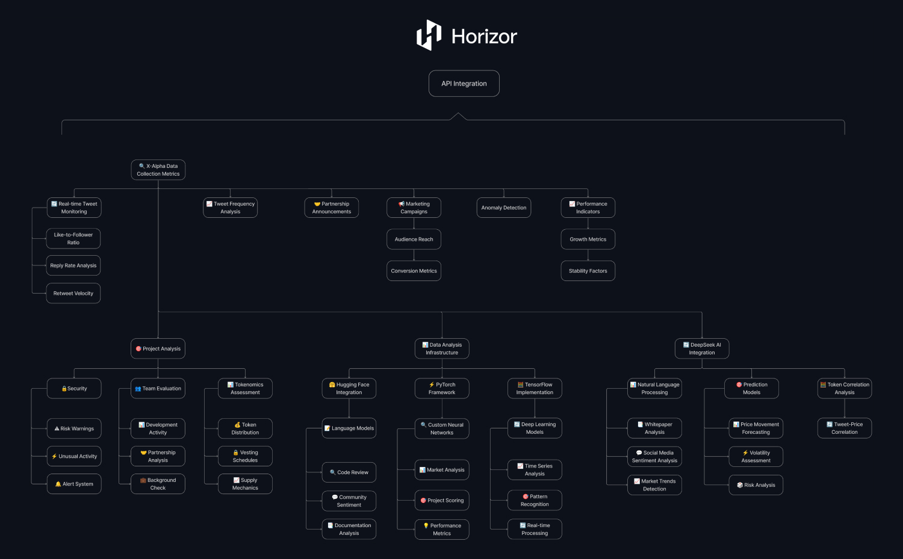

<h1 align="center">Horizor App</h1>

<p align="center">
Advanced AI-powered platform for pre-launch blockchain project analysis. Built on Solana's high-performance blockchain, Horizor combines machine learning, NLP, and comprehensive data analytics to evaluate projects based on Twitter activity, website quality, GitHub contributions, whitepaper analysis, tokenomics, and market uniqueness.
</p>

<div align="center">
 
[](https://www.deepseek.com/)
[](https://www.tensorflow.org/)
[](https://pytorch.org/)
[](https://huggingface.co/)
[](https://keras.io/)
[](https://solana.com/)

[](https://github.com/horizorapp/horizor-app)
[](https://opensource.org/licenses/MIT)
[]([https://github.com/horizorapp/horizor-app/graphs/commit-activity](https://github.com/horizorapp/horizor/graphs/commit-activity))

</div>

<p align="center">
  <a href="https://horizor.app">Website</a> •
  <a href="https://horizorapp.gitbook.io/docs">Documentation</a> •
  <a href="https://horizor.app#Roadmap">Roadmap</a>
</p>


## 🔧 Core Features

- **Token Analytics**: Deep analysis of Solana tokens
- **Risk Assessment**: Advanced risk scoring and indicators
- **AI Agents**: Interactive AI-powered analysis
- **Batch Processing**: Efficient multi-token analysis
- **Real-time Data**: Live on-chain analytics

## 📊 Token Analysis Example

```typescript
import HorizorClient from 'horizorapp';

async function analyzeProject(projectId: string) {
  const client = new HorizorClient();
  const analysis = await client.getProjectAnalysis(projectId);

  console.log(`
Project Analysis Results:
-------------------------
Name: ${analysis.data.projectName}
AI Score: ${analysis.data.score}/100
Twitter Activity: ${analysis.data.twitterEngagement}%
Website Trust Score: ${analysis.data.websiteTrustScore}%
GitHub Activity: ${analysis.data.githubCommits} commits
Tokenomics Risk: ${analysis.data.tokenomicsRisk ? 'High' : 'Low'}
Market Uniqueness: ${analysis.data.marketUniqueness}%
  
Project Links:
Website: ${analysis.data.links.website}
Twitter: ${analysis.data.links.twitter}
GitHub: ${analysis.data.links.github}
Whitepaper: ${analysis.data.links.whitepaper}
  `);
}

```


## 🧑‍💼 AI-Powered Blockchain Analysis

We implement cutting-edge machine learning algorithms using powerful frameworks such as TensorFlow, PyTorch, and Hugging Face. These frameworks enable the creation of highly efficient models for analyzing vast amounts of data and generating actionable insights.
Horizor employs NLP models like DeepSeek and BERT to analyze whitepapers, tweets, and other text content from blockchain projects. This allows us to understand project intentions, detect inconsistencies, and identify potential risks or opportunities.



Based on machine learning and historical data from past successful and failed tokens, Horizor AI precisely predicts the potential of new projects. The platform evaluates factors such as market sentiment, community engagement, tokenomics, and GitHub activity to provide users with an overall project rating.

We actively enhance our machine learning models, continuously refining AI predictions with new data. This approach enables our system to adapt to market changes, analyze current trends, and ensure accuracy and reliability for investors, helping them make well-informed decisions.


## 🔍 Advanced Usage

### Batch Processing

```typescript
import { HorizorClient, ProjectData } from 'horizor-app';

async function batchAnalysis(projectIds: string[]) {
  const client = new HorizorClient();
  const batchSize = 5;
  
  for (let i = 0; i < projectIds.length; i += batchSize) {
    const batch = projectIds.slice(i, i + batchSize);
    const analyses = await Promise.all(
      batch.map(id => client.analyzeProject(id))
    );
    
    // Process batch results
    analyses.forEach(analysis => {
      if (analysis.data.score < 5) {
        console.log(`High Risk Project: ${analysis.data.projectName}`);
        console.log(`Risk Factors: ${JSON.stringify(analysis.data.tokenomics)}`);
      }
    });
  }
}
```


## API Integration

```typescript
import { HorizorClient, AnalysisMessage } from 'horizor-app';

async function analyzeProjectWithAI() {
  // Initialize the client
  const client = new HorizorClient();

  // Define the analysis request
  const messages: AnalysisMessage[] = [
    {
      role: 'user',
      content: 'Analyze the risks and potential of project XYZ based on Twitter, GitHub, and Whitepaper data.',
    },
  ];

  try {
    // Send the analysis request to the AI analyst
    const analysisResponse = await client.analyzeWithAI('analyst-id', messages);
    
    // Log the AI-generated analysis
    console.log('AI Analysis:', analysisResponse.data.response);
  } catch (error) {
    console.error('Error during analysis:', error.message);
  }
}

analyzeProjectWithAI();
```


## Roadmap

- [ ] API integration for displaying AI analysis results in the Dashboard
- [ ] Ability to sort projects by rating, activity, and date added
- [ ] Development of a Telegram bot for instant notifications about new project launches and their summaries
- [ ] Creation of a Pro subscription with payment in $Horizor  to allow users to run their own project analysis based on Twitter data
- [ ] Providing a more detailed summary in the Pro vision, covering all aspects analyzed by our AI
Adding charts for visualizing activity on Twitter and GitHub


## Documentation

For detailed documentation, visit [docs.horizor.app](https://horizorapp.gitbook.io/docs)


## License

MIT © [Horizor Team](LICENSE)
